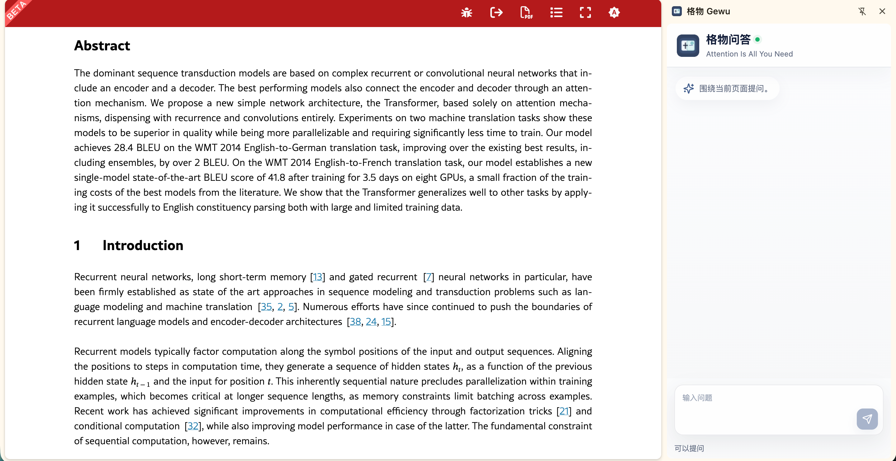
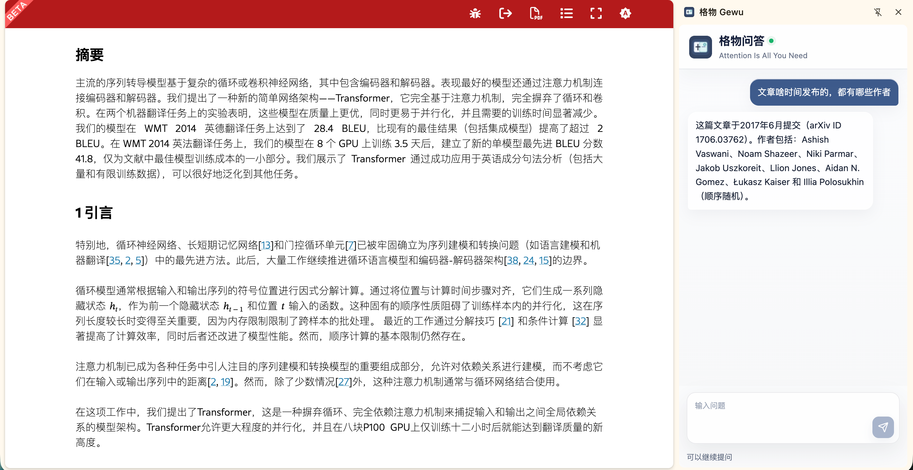
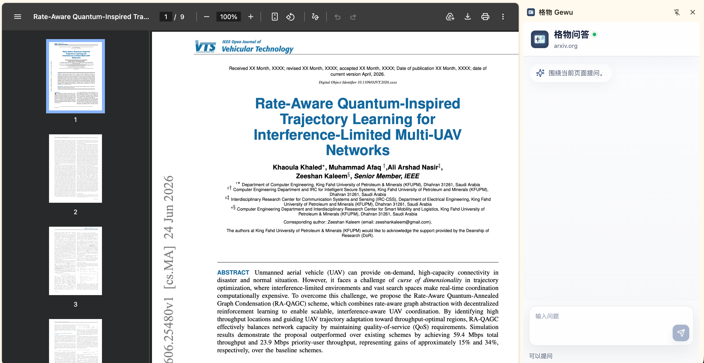
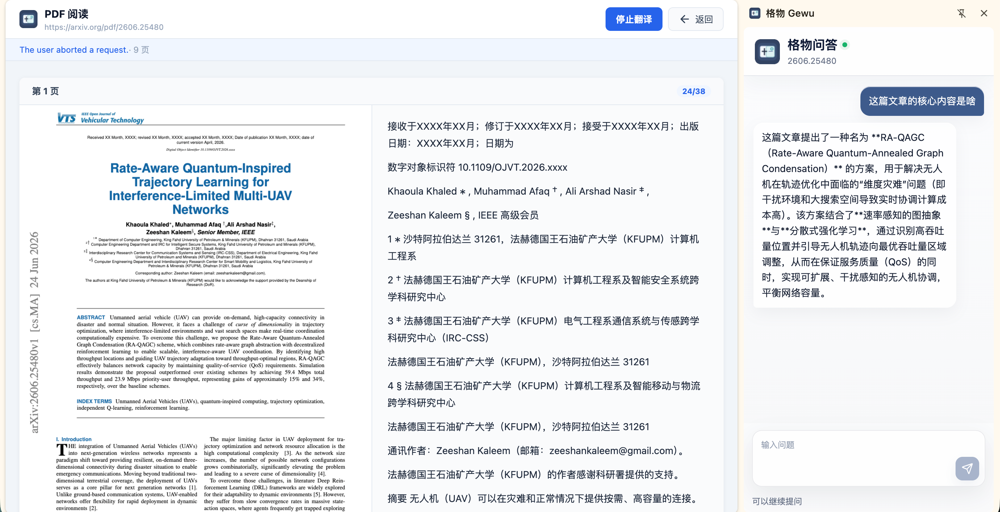

# 格物 · Gewu

> 致知在格物。——《大学》

浏览器插件，外文网页 / PDF 双栏翻译 + AI 对话。专为 arXiv 论文阅读打造，用户自备 API Key。

格物不提供自建后端：页面内容由浏览器直接发送到用户配置的模型服务商。

## 当前状态

v0.2.0，支持 Chrome / Edge MV3：

- **网页原地翻译**：当前页文本直接替换为中文，保留链接和页面结构。
- **PDF 阅读器**：自动检测 PDF URL，打开内置阅读器，PDF 页面对照译文，滚动懒翻译。
- **沉浸阅读模式**：提取页面正文，在新标签页双栏对照阅读。
- **AI 对话**：Side Panel 基于当前页面内容持续问答。
- **译文缓存**：IndexedDB 自动缓存，相同页面二次打开秒出译文。
- **加密存储**：API Key 自动加密后落盘，不存储明文。
- 支持 **DeepSeek / OpenAI 兼容 / Anthropic Claude**，用户自备 API Key。

## 效果预览

### 网页翻译

原始英文页面：



翻译后：



### PDF 翻译

原始 PDF 页面——内置阅读器渲染原始 PDF：



翻译后——左侧 PDF 右侧译文，逐页对照，标签显示翻译进度：



## 本地开发

```bash
npm install       # 安装依赖
npm run dev       # 开发构建
npm run build     # 生产构建
npm run typecheck # 类型检查
npm run lint      # 代码规范
```

## 在 Chrome 中加载

1. `npm run build`
2. 打开 `chrome://extensions/`，开启开发者模式
3. 加载 `dist/` 目录
4. 固定插件图标到工具栏

## 配置

1. 打开插件 Options 页面。
2. 选择服务商：DeepSeek / OpenAI 兼容 或 Anthropic Claude。
3. 填入 API Key，确认 Base URL 和模型。
4. 保存（页面自动关闭）。

DeepSeek 默认配置：

```text
Base URL: https://api.deepseek.com
Model: deepseek-v4-flash
```

API Key 自动加密存储在浏览器本地。格物不上传 Key 到任何服务器。

## 使用方式

### 翻译网页

1. 打开外文网页。
2. 点击工具栏格物图标 → **翻译当前页**。
3. 页面文本原地替换为中文，侧栏问答自动打开。
4. 再次点击恢复原文。

### 翻译 PDF

1. 打开 PDF 链接（如 arXiv PDF）。
2. 点击 **翻译当前页** → 自动打开 PDF 阅读器。
3. 左侧 PDF 页面，右侧对照译文，逐页显示翻译进度。
4. 向下滚动，后续页面自动翻译。
5. 侧栏可针对文章内容提问。

### 沉浸阅读

1. 打开网页 → 点击 Popup **阅读**（已合并到翻译当前页）。
2. 或：在 PDF 阅读器中直接在当前页双栏对照阅读。

### 页面问答

1. 翻译时 Side Panel 自动打开。
2. 也可单独点击 Popup **问答** 打开。
3. 当前页面 / PDF 内容作为上下文。
4. 直接提问（Enter 发送，Shift+Enter 换行）。

## 验证清单

- `npm run typecheck && npm run lint` 通过
- `npm run build` 生成可加载的 `dist/`
- Chrome 加载 `dist/` 无 manifest 错误
- Options 保存并读取 API Key
- 网页翻译：文字替换为中文，恢复原文无残留
- PDF 翻译：自动打开阅读器，逐页对照翻译
- 滚动懒翻译：可见区域优先，往下滚动继续翻
- 译文缓存：同 URL 二次打开秒出译文
- Side Panel 基于页面内容问答
- API Key 加密落盘（chrome.storage.local 中非明文）
- 错误提示（Key 错误、网络失败、限流）明确可理解

## 常见问题

**加载扩展时报 manifest 错误**

确认执行的是 `npm run build`，加载的是 `dist/` 目录。

**点击翻译没有结果**

检查 Options 是否已保存 API Key。查看扩展 background service worker 控制台。

**页面布局被影响**

再次点击“翻译当前页”恢复原文。当前默认原网页文本替换模式。

**PDF 翻译打开空白**

PDF URL 需可公开访问。确认 URL 正确且服务端允许跨域请求。

**问答没有页面上下文**

等待 PDF 加载完成后重试。侧栏会自动重试获取上下文。

## 技术设计

详见 [docs/gewu-design.md](docs/gewu-design.md)。

## 发布

版本递增、打包和 tag 流程详见 [docs/release.md](docs/release.md)。
